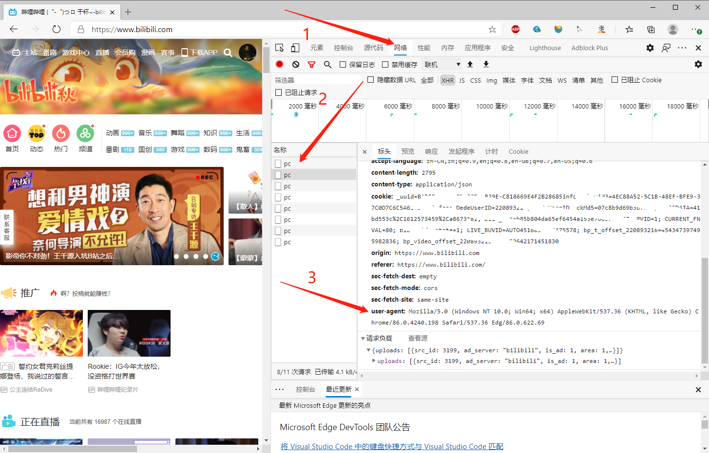
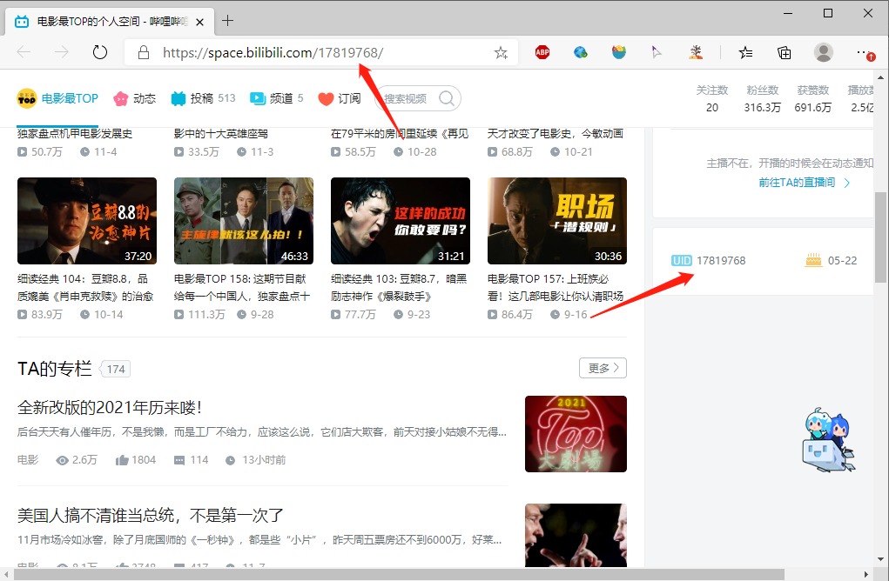
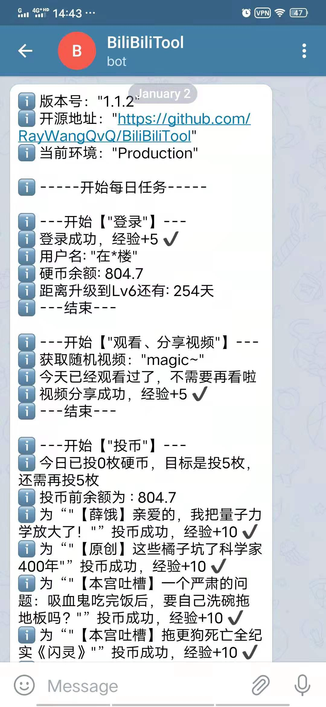
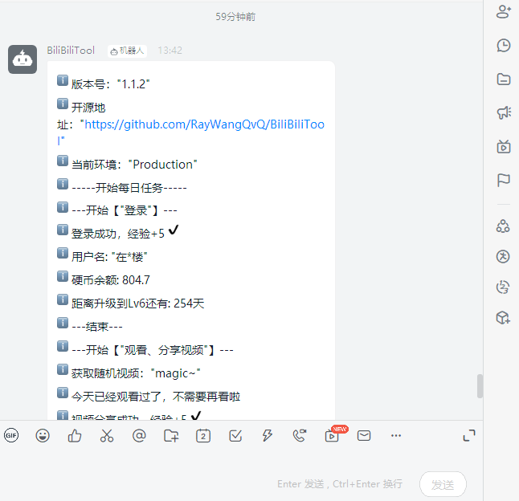
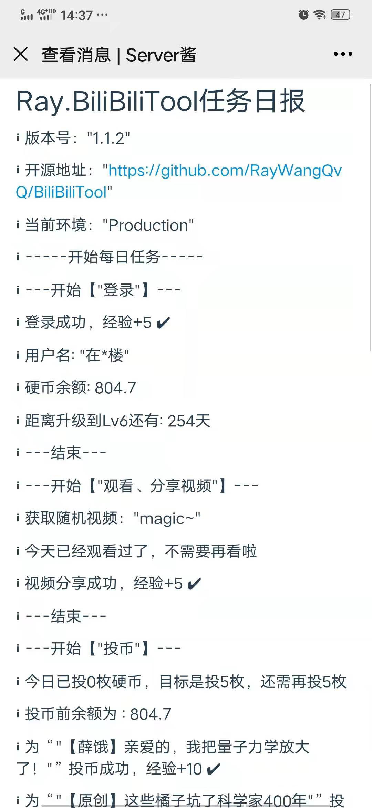

# 配置说明

**[目录]**

<!-- TOC depthFrom:2 insertAnchor:true -->

- [1. 配置方式](#1-配置方式)
    - [1.1. 方式一：修改配置文件](#11-方式一修改配置文件)
    - [1.2. 方式二：命令启动时通过命令行参数配置](#12-方式二命令启动时通过命令行参数配置)
    - [1.3. 方式三：添加环境变量（推荐）](#13-方式三添加环境变量推荐)
    - [1.4. ~~方式四：托管在GitHub Actions上，使用GitHub Secrets配置~~](#14-方式四托管在github-actions上使用github-secrets配置)
    - [1.5. 方式五：托管在青龙面板上，使用面板的环境变量页或配置文件页进行配置](#15-方式五托管在青龙面板上使用面板的环境变量页或配置文件页进行配置)
- [2. 优先级](#2-优先级)
- [3. 详细配置说明](#3-详细配置说明)
    - [3.1. Cookie字符串](#31-cookie字符串)
    - [3.2. 安全相关的配置](#32-安全相关的配置)
        - [3.2.1. 是否跳过执行任务](#321-是否跳过执行任务)
        - [3.2.2. 随机睡眠的最大时长](#322-随机睡眠的最大时长)
        - [3.2.3. 两次调用B站Api之间的间隔秒数](#323-两次调用b站api之间的间隔秒数)
        - [3.2.4. 间隔秒数所针对的HttpMethod](#324-间隔秒数所针对的httpmethod)
        - [3.2.5. 请求B站接口时头部传递的User-Agent](#325-请求b站接口时头部传递的user-agent)
        - [3.2.6. WebProxy（代理）](#326-webproxy代理)
    - [3.3. 每日任务相关](#33-每日任务相关)
        - [3.3.1. 每日投币数量](#331-每日投币数量)
        - [3.3.2. 投币时是否同时点赞](#332-投币时是否同时点赞)
        - [3.3.3. 优先选择支持的up主Id集合](#333-优先选择支持的up主id集合)
        - [3.3.4. 每月几号自动充电](#334-每月几号自动充电)
        - [3.3.5. 充电对象](#335-充电对象)
        - [3.3.6. 每月几号自动领取会员权益](#336-每月几号自动领取会员权益)
        - [3.3.7. 每月几号进行直播中心银瓜子兑换硬币](#337-每月几号进行直播中心银瓜子兑换硬币)
    - [3.4. 天选时刻抽奖相关](#34-天选时刻抽奖相关)
        - [3.4.1. 根据关键字排除奖品](#341-根据关键字排除奖品)
        - [3.4.2. 根据关键字指定奖品](#342-根据关键字指定奖品)
        - [3.4.3. 天选抽奖后是否自动分组关注的主播](#343-天选抽奖后是否自动分组关注的主播)
        - [3.4.4. 天选筹抽奖主播Uid黑名单](#344-天选筹抽奖主播uid黑名单)
    - [3.5. 批量取关相关](#35-批量取关相关)
        - [3.5.1. 想要批量取关的分组名称](#351-想要批量取关的分组名称)
        - [3.5.2. 批量取关的人数](#352-批量取关的人数)
        - [3.5.3. 取关白名单](#353-取关白名单)
    - [3.6. 推送相关](#36-推送相关)
        - [3.6.1. 是否开启每个账号单独推送消息](#361-是否开启每个账号单独推送消息)
        - [3.6.2. Telegram机器人](#362-telegram机器人)
            - [3.6.2.1. botToken](#3621-bottoken)
            - [3.6.2.2. chatId](#3622-chatid)
        - [3.6.3. 企业微信机器人](#363-企业微信机器人)
            - [3.6.3.1. webHookUrl](#3631-webhookurl)
        - [3.6.4. 钉钉机器人](#364-钉钉机器人)
            - [3.6.4.1. webHookUrl](#3641-webhookurl)
        - [3.6.5. Server酱](#365-server酱)
            - [3.6.5.1. TurboScKey（Server酱SCKEY）](#3651-turbosckeyserver酱sckey)
        - [3.6.6. 酷推](#366-酷推)
            - [3.6.6.1. sKey](#3661-skey)
        - [3.6.7. 推送到自定义Api](#367-推送到自定义api)
            - [3.6.7.1. api](#3671-api)
            - [3.6.7.2. placeholder](#3672-placeholder)
            - [3.6.7.3. bodyJsonTemplate](#3673-bodyjsontemplate)
        - [3.6.8. PushPlus[推荐]](#368-pushplus推荐)
            - [3.6.8.1. PushPlus的Token](#3681-pushplus的token)
            - [3.6.8.2. PushPlus的Topic](#3682-pushplus的topic)
            - [3.6.8.3. PushPlus的Channel](#3683-pushplus的channel)
            - [3.6.8.4. PushPlus的Webhook](#3684-pushplus的webhook)
        - [3.6.9. Microsoft Teams](#369-microsoft-teams)
            - [3.6.9.1. Microsoft Teams的Webhook](#3691-microsoft-teams的webhook)
        - [3.6.10. 企业微信应用推送](#3610-企业微信应用推送)
            - [3.6.10.1. 企业微信应用推送的corpId](#36101-企业微信应用推送的corpid)
            - [3.6.10.2. 企业微信应用推送的agentId](#36102-企业微信应用推送的agentid)
            - [3.6.10.3. 企业微信应用推送的secret](#36103-企业微信应用推送的secret)
    - [3.7. 日志相关](#37-日志相关)
        - [3.7.1. Console日志输出等级](#371-console日志输出等级)
        - [3.7.2. Console日志输出样式](#372-console日志输出样式)

<!-- /TOC -->

<a id="markdown-1-配置方式" name="1-配置方式"></a>
## 1. 配置方式

<a id="markdown-11-方式一修改配置文件" name="11-方式一修改配置文件"></a>
### 1.1. 方式一：修改配置文件
推荐使用Release包在本地运行的朋友使用，直接打开文件，将对应的配置值填入，保存即可生效。

默认有3个配置文件：`appsettings.json`、`appsettings.Development.json`、`appsettings.Production.json`，分别对应默认、开发与生产环境。

如果运行环境为开发环境，则`appsettings.Development.json`优先级高于`appsettings.json`，即`appsettings.Development.json`里的配置会覆盖默认配置（不是全部覆盖，`appsettings.Development.json`里加了几个就覆盖几个）；

如果运行环境为生产环境，则`appsettings.Production.json`优先级高于`appsettings.json`，即`appsettings.Production.json`里的配置会覆盖默认配置（同样不是全部覆盖，`appsettings.Production.json`里加了几个就覆盖几个）。

对于不是开发人员的大部分人来说，只需要关注`appsettings.Production.json`即可，因为非调试状态下运行的默认环境就是生产环境。此时如需自定义配置，推荐在`appsettings.Production.json`文件中进行修改（并且以后都只修改`appsettings.Production.json`文件，`appsettings.json`只作为默认的全量模板而存在）

<a id="markdown-12-方式二命令启动时通过命令行参数配置" name="12-方式二命令启动时通过命令行参数配置"></a>
### 1.2. 方式二：命令启动时通过命令行参数配置
在使用命令行启动时，可使用`-key=value`的形式附加配置，所有可用的命令行参数均在 [命令行参数映射](../src/Ray.BiliBiliTool.Console/commandLineMappings.json) 文件中。

* 使用跨平台的依赖包

各个系统只要安装了net5环境，均可使用dotnet命令启动，命令样例：

```
dotnet Ray.BiliBiliTool.Console.dll -cookieStr=abc -numberOfCoins=5
```

* Windows系统

使用自包含包（win-x86-x64.zip），命令样例：

```
Ray.BiliBiliTool.Console.exe -cookieStr=abc -numberOfCoins=5
```

* Linux系统

使用自包含包（linux.zip），命令样例：

```
Ray.BiliBiliTool.Console -cookieStr=abc -numberOfCoins=5
```

如映射文件所展示，支持使用命令行配置的配置项并不多，也不建议大量地使用该种方式进行配置。使用包运行的朋友，除了改配置文件和命令行参数配置外，还可以使用环境变量进行配置，这也是推荐的做法，如下。

<a id="markdown-13-方式三添加环境变量推荐" name="13-方式三添加环境变量推荐"></a>
### 1.3. 方式三：添加环境变量（推荐）

所有的配置项均可以通过添加环境变量来进行配置，以Windows下依赖net5的系统为例：

```
# 添加环境变量作为配置：
set Ray_RunTasks=Daily
set Ray_BiliBiliCookies__1=abc
set Ray_BiliBiliCookies__2=efg
set Ray_DailyTaskConfig__NumberOfCoins=3

# 开始运行程序：
dotnet Ray.BiliBiliTool.Console.dll
```

注意区分单下划线和双下划线，linux系统使用 `export` 关键字代替 `set` 。

<a id="markdown-14-方式四托管在github-actions上使用github-secrets配置" name="14-方式四托管在github-actions上使用github-secrets配置"></a>
### 1.4. ~~方式四：托管在GitHub Actions上，使用GitHub Secrets配置~~

已废除，当前不支持使用`GitHub Action`直接运行应用，`GitHub Action`只用于部署

<details>

~~使用GitHub Actions，可以通过添加Secret实现配置。~~

~~比如，配置微信推送的SCKEY，可以添加如下Secret：~~

~~Secret Name：`PUSHSCKEY`~~

~~Secret Value：`123abc`~~

~~这些 Secrets 会通过 workflow 里的yml脚本映射为环境变量，在应用启动时作为环境变量配置源传入程序当中，所以使用 GitHub Secrets 配置的本质是使用环境变量配置。~~


</details>

<a id="markdown-15-方式五托管在青龙面板上使用面板的环境变量页或配置文件页进行配置" name="15-方式五托管在青龙面板上使用面板的环境变量页或配置文件页进行配置"></a>
### 1.5. 方式五：托管在青龙面板上，使用面板的环境变量页或配置文件页进行配置

青龙面板配置，其本质还是通过环境变量进行配置，有如下两种方式。

- 环境变量页[推荐]

例如：

名称：`Ray_BiliBiliCookies__1`

值：`abcde`


- 配置文件页

例如，配置Cookie和推送：

```
export Ray_BiliBiliCookies__1="_uuid=abc..."
export Ray_Serilog__WriteTo__9__Args__token="abcde"
```


配置文件页添加、修改配置，需要重启青龙容器使之生效，环境变量页则可以立即生效，所以推荐使用环境变量页配置。

<a id="markdown-2-优先级" name="2-优先级"></a>
## 2. 优先级

以上 4 种配置源，其优先级由低到高依次是：json文件 < 环境变量(和Github Secrets) < 命令行。

高优先级的配置会覆盖低优先级的配置。

<a id="markdown-3-详细配置说明" name="3-详细配置说明"></a>
## 3. 详细配置说明

<a id="markdown-31-cookie字符串" name="31-cookie字符串"></a>
### 3.1. Cookie字符串

必填。

| TITLE | CONTENT | 示例 |
| ---------- | -------------- | -------------- |
| 配置Key | `BiliBiliCookies:1` | |
| 值域   | 字符串，英文分号分隔，来自浏览器抓取 | |
| 默认值   | 空 | |
| 环境变量 | `Ray_BiliBiliCookies__1` | Windows：`set Ray_BiliBiliCookies__1=abc=123;def=456;` Linux:`export Ray_BiliBiliCookies__1=abc=123;def=456;` |
| GitHub Secrets | `COOKIESTR` | Name:`COOKIESTR`  Value: `abc=123;def=456;`|

|   TITLE   | CONTENT   | 示例 |
| ---------- | -------------- | -------------- |
| 配置Key | `BiliBiliCookies:2` | |
| 值域   | 字符串，英文分号分隔，来自浏览器抓取 | |
| 默认值   | 空 | |
| 环境变量  | `Ray_BiliBiliCookies__2` | Windows：`set Ray_BiliBiliCookies__2=abc=123;def=456;` Linux:`export Ray_BiliBiliCookies__2=abc=123;def=456;` |
| GitHub Secrets  | `COOKIESTR2` | Name:`COOKIESTR2`  Value: `abc=123;def=456;`|

**...**
**...**
**...**

<a id="markdown-32-安全相关的配置" name="32-安全相关的配置"></a>
### 3.2. 安全相关的配置
<a id="markdown-321-是否跳过执行任务" name="321-是否跳过执行任务"></a>
#### 3.2.1. 是否跳过执行任务
用于特殊情况下，通过配置灵活的开启和关闭整个应用.
配置为关闭后，程序会跳过所有任务，不会调用B站任何接口。

|   TITLE   | CONTENT   | 示例 |
| ---------- | -------------- | -------------- |
| 配置Key | `Security:IsSkipDailyTask` | |
| 值域   | [true,false] | |
| 默认值   | false | |
| 环境变量 | `Ray_Security__IsSkipDailyTask` | `set Ray_Security__IsSkipDailyTask=true` |
| GitHub Secrets | `ISSKIPDAILYTASK` | Name:`ISSKIPDAILYTASK`  Value: `true`|

<a id="markdown-322-随机睡眠的最大时长" name="322-随机睡眠的最大时长"></a>
#### 3.2.2. 随机睡眠的最大时长

用于设置程序启动后，随机睡眠时间的最大上限值，单位为分钟。
这样可以避免程序每天准点地在同一时间运行太像机器。

配置为0则不进行睡眠。

|   TITLE   | CONTENT   |
| ---------- | -------------- |
| 配置Key | `Security:RandomSleepMaxMin` |
| 值域   | 数字 |
| 默认值   | 20 |
| 环境变量 | `Ray_Security__RandomSleepMaxMin` |
| GitHub Secrets | `RANDOMSLEEPMAXMIN`|

<a id="markdown-323-两次调用b站api之间的间隔秒数" name="323-两次调用b站api之间的间隔秒数"></a>
#### 3.2.3. 两次调用B站Api之间的间隔秒数

用于设置两次Api请求之间的最短时间间隔，避免程序在1到2秒内连续调用B站的Api过快。

|   TITLE   | CONTENT   |
| ---------- | -------------- |
| 配置Key | `Security:IntervalSecondsBetweenRequestApi` |
| 值域   | [0,+] |
| 默认值   | 20 |
| 环境变量   | `Ray_Security__IntervalSecondsBetweenRequestApi` |
| GitHub Secrets | `INTERVALSECONDSBETWEENREQUESTAPI` |


<a id="markdown-324-间隔秒数所针对的httpmethod" name="324-间隔秒数所针对的httpmethod"></a>
#### 3.2.4. 间隔秒数所针对的HttpMethod
间隔秒数所针对的HttpMethod类型，服务于上一个配置。服务器一般对GET请求不是很敏感，建议只针对POST请求做间隔就可以了。

|   TITLE   | CONTENT   |
| ---------- | -------------- |
| 配置Key | `Security:IntervalMethodTypes` |
| 值域   | [GET,POST]，多个以英文逗号分隔 |
| 默认值   | POST |
| 环境变量   | `Ray_Security__IntervalMethodTypes` |
| GitHub Secrets  | `INTERVALMETHODTYPES` |

<a id="markdown-325-请求b站接口时头部传递的user-agent" name="325-请求b站接口时头部传递的user-agent"></a>
#### 3.2.5. 请求B站接口时头部传递的User-Agent

|   TITLE   | CONTENT   |
| ---------- | -------------- |
| 配置Key | `Security:UserAgent` |
| 值域   | 字符串，可以F12从自己的浏览器获取 |
| 默认值   | Mozilla/5.0 (Macintosh; Intel Mac OS X 10_15_3) AppleWebKit/537.36 (KHTML, like Gecko) Chrome/87.0.4280.66 Safari/537.36 Edg/87.0.664.41 |
| 环境变量   | `Ray_Security__UserAgent` |
| GitHub Secrets  | `USERAGENT`|

获取浏览器中自己的UA的方法见下图：




<a id="markdown-326-webproxy代理" name="326-webproxy代理"></a>
#### 3.2.6. WebProxy（代理）
支持需要账户密码的代理。

|   TITLE   | CONTENT   |
| ---------- | -------------- |
| 配置Key | `Security:WebProxy` |
| 值域   | 字符串，形如：user:password@host:port |
| 默认值   | 无 |
| 环境变量   | `Ray_Security__WebProxy` |
| GitHub Secrets  | `WEBPROXY`|

<a id="markdown-33-每日任务相关" name="33-每日任务相关"></a>
### 3.3. 每日任务相关
<a id="markdown-331-每日投币数量" name="331-每日投币数量"></a>
#### 3.3.1. 每日投币数量
每天投币的总目标数量，因为投币获取经验只与次数有关，所以程序每次投币只会投1个，也就是说该配置也表示每日投币次数。

|   TITLE   | CONTENT   |
| ---------- | -------------- |
| 配置Key | `DailyTaskConfig:NumberOfCoins` |
| 值域   | [0,5]，为安全考虑，程序内部还会做验证，最大不能超过5 |
| 默认值   | 5 |
| 环境变量   | `Ray_DailyTaskConfig__NumberOfCoins` |
| GitHub Secrets  | `NUMBEROFCOINS` |

<a id="markdown-332-投币时是否同时点赞" name="332-投币时是否同时点赞"></a>
#### 3.3.2. 投币时是否同时点赞

|   TITLE   | CONTENT   |
| ---------- | -------------- |
| 配置Key | `DailyTaskConfig:SelectLike` |
| 值域   | [true,false] |
| 默认值   | false |
| 环境变量   | `Ray_DailyTaskConfig__SelectLike` |
| GitHub Secrets  | `SELECTLIKE` |

<a id="markdown-333-优先选择支持的up主id集合" name="333-优先选择支持的up主id集合"></a>
#### 3.3.3. 优先选择支持的up主Id集合

通过填入自己选择的up主ID，以后观看、分享和投币，都会优先从配置的up主下面挑选视频，如果没有找到,则会去你的**特别关注**列表中随机再获取，再然后会去**普通关注**列表中随机获取，最后会去排行榜中随机获取。

**注意：该配置的默认值是作者的upId，如需换掉的话，直接更改即可。**

|   TITLE   | CONTENT   |
| ---------- | -------------- |
| 配置Key | `DailyTaskConfig:SupportUpIds` |
| 值域   | up主ID，多个用英文逗号分隔，默认是作者本人的UpId，如需删除可以配置为空格字符串或“-1”，也可以配置为其他人的UpId |
| 默认值   | 作者的upId |
| 环境变量   | `Ray_DailyTaskConfig__SupportUpIds` |
| GitHub Secrets  | `SUPPORTUPIDS` |

获取UP主的Id方法：打开bilibili，进入欲要选择的UP主主页，在url中和简介中，都可获得该UP主的Id，如下图所示：



<a id="markdown-334-每月几号自动充电" name="334-每月几号自动充电"></a>
#### 3.3.4. 每月几号自动充电

使用大会员免费赠送的B币券自动充电，如不使用，每个月结束会自动失效。没有B币券或B币券余额不足2，不会进行充电。

|   TITLE   | CONTENT   |
| ---------- | -------------- |
| 配置Key | `DailyTaskConfig:DayOfAutoCharge` |
| 值域   | [-1,31]，-1表示不指定，默认月底最后一天；0表示不充电 |
| 默认值   | -1 |
| 环境变量   | `Ray_DailyTaskConfig__DayOfAutoCharge` |
| GitHub Secrets  | `DAYOFAUTOCHARGE` |

<a id="markdown-335-充电对象" name="335-充电对象"></a>
#### 3.3.5. 充电对象

充电对象的upId，需要配合前一个DayOfAutoCharge配置项使用。-1表示不指定，默认为自己充电；其他Id则会尝试为配置的UpId充电。

注意：该配置的默认值是作者的upId，如果你已认证通过了创作身份（即可以为自己充电），则建议将其改为为自己充电（配置为-1即可），也可以配置为某个自己指定的创作者upId。

|   TITLE   | CONTENT   |
| ---------- | -------------- |
| 配置Key | `DailyTaskConfig:AutoChargeUpId` |
| 值域   | up的Id字符串，默认是作者本人的UpId；-1表示不指定，为自己充电；其他Id则会尝试为配置的UpId充电 |
| 默认值   | 作者的upId |
| 环境变量   | `Ray_DailyTaskConfig__AutoChargeUpId` |
| GitHub Secrets  | `AUTOCHARGEUPID` |

<a id="markdown-336-每月几号自动领取会员权益" name="336-每月几号自动领取会员权益"></a>
#### 3.3.6. 每月几号自动领取会员权益

|   TITLE   | CONTENT   |
| ---------- | -------------- |
| 配置Key | `DailyTaskConfig:DayOfReceiveVipPrivilege` |
| 值域   | [-1,31]，-1表示不指定，默认每月1号；0表示不领取 |
| 默认值   | 1 |
| 环境变量   | `Ray_DailyTaskConfig__DayOfReceiveVipPrivilege` |
| GitHub Secrets  | `DAYOFRECEIVEVIPPRIVILEGE` |

<a id="markdown-337-每月几号进行直播中心银瓜子兑换硬币" name="337-每月几号进行直播中心银瓜子兑换硬币"></a>
#### 3.3.7. 每月几号进行直播中心银瓜子兑换硬币

|   TITLE   | CONTENT   |
| ---------- | -------------- |
| 配置Key | `DailyTaskConfig:DayOfExchangeSilver2Coin` |
| 值域   | [-1,31]，-1表示不指定，默认每月最后一天；-2表示每天；0表示不进行兑换 |
| 默认值   | -1 |
| 环境变量   | `Ray_DailyTaskConfig__DayOfExchangeSilver2Coin` |
| GitHub Secrets  | `DayOfExchangeSilver2Coin` |

<a id="markdown-34-天选时刻抽奖相关" name="34-天选时刻抽奖相关"></a>
### 3.4. 天选时刻抽奖相关

<a id="markdown-341-根据关键字排除奖品" name="341-根据关键字排除奖品"></a>
#### 3.4.1. 根据关键字排除奖品

|   TITLE   | CONTENT   |
| ---------- | -------------- |
| 配置Key | `LiveLotteryTaskConfig:ExcludeAwardNames` |
| 值域   | 一串字符串，多个关键字使用`\|`符号隔开 |
| 默认值   | `舰\|船\|航海\|代金券\|自拍\|照\|写真\|图` |
| 环境变量   | `Ray_LiveLotteryTaskConfig__ExcludeAwardNames` |
| GitHub Secrets  | `EXCLUDEAWARDNAMES` |

<a id="markdown-342-根据关键字指定奖品" name="342-根据关键字指定奖品"></a>
#### 3.4.2. 根据关键字指定奖品

|   TITLE   | CONTENT   |
| ---------- | -------------- |
| 配置Key | `LiveLotteryTaskConfig:IncludeAwardNames` |
| 值域   | 一串字符串，多个关键字使用`\|`符号隔开 |
| 默认值   | 空 |
| 环境变量   | `Ray_LiveLotteryTaskConfig__IncludeAwardNames` |
| GitHub Secrets  | `INCLUDEAWARDNAMES` |

<a id="markdown-343-天选抽奖后是否自动分组关注的主播" name="343-天选抽奖后是否自动分组关注的主播"></a>
#### 3.4.3. 天选抽奖后是否自动分组关注的主播

|   TITLE   | CONTENT   |
| ---------- | -------------- |
| 配置Key | `LiveLotteryTaskConfig:AutoGroupFollowings` |
| 值域   | [true,false] |
| 默认值   | true |
| 环境变量   | `Ray_LiveLotteryTaskConfig__AutoGroupFollowings` |
| GitHub Secrets  | `AUTOGROUPFOLLOWINGS`  Value: `true`|

<a id="markdown-344-天选筹抽奖主播uid黑名单" name="344-天选筹抽奖主播uid黑名单"></a>
#### 3.4.4. 天选筹抽奖主播Uid黑名单

不想参与抽奖的主播Upid集合，多个用英文逗号分隔，配置后不会参加黑名单中的主播的抽奖活动。默认值是目前已知的中奖后拒绝发奖的Up，后期还会继续补充，也反映反馈。
|   TITLE   | CONTENT   |
| ---------- | -------------- |
| 配置Key | `LiveLotteryTaskConfig:DenyUids` |
| 值域   | 字符串，如"65566781,1277481241" |
| 默认值   | "65566781,1277481241,1643654862,603676925" |
| 环境变量   | `Ray_LiveLotteryTaskConfig__DenyUids` |
| GitHub Secrets  | `LIVELOTTERYDENYUIDS`  Value: `65566781,1277481241,1643654862,603676925`|

<a id="markdown-35-批量取关相关" name="35-批量取关相关"></a>
### 3.5. 批量取关相关

<a id="markdown-351-想要批量取关的分组名称" name="351-想要批量取关的分组名称"></a>
#### 3.5.1. 想要批量取关的分组名称

|   TITLE   | CONTENT   |
| ---------- | -------------- |
| 配置Key | `UnfollowBatchedTaskConfig:GroupName` |
| 值域   | 字符串 |
| 默认值   | 天选时刻 |
| 环境变量   | `Ray_UnfollowBatchedTaskConfig__GroupName` |
| GitHub Secrets  | 无，在unfollow-batched-task.yml工作流中通过input输入 |

<a id="markdown-352-批量取关的人数" name="352-批量取关的人数"></a>
#### 3.5.2. 批量取关的人数

|   TITLE   | CONTENT   |
| ---------- | -------------- |
| 配置Key | `UnfollowBatchedTaskConfig:Count` |
| 值域   | 数字，[-1,+]，-1表示全部 |
| 默认值   | 5 |
| 环境变量   | `Ray_UnfollowBatchedTaskConfig__Count` |
| GitHub Secrets  | 无，在unfollow-batched-task.yml工作流中通过input输入 |

<a id="markdown-353-取关白名单" name="353-取关白名单"></a>
#### 3.5.3. 取关白名单

|   TITLE   | CONTENT   |
| ---------- | -------------- |
| 配置Key | `UnfollowBatchedTaskConfig:RetainUids` |
| 值域   | 字符串，多个使用英文逗号分隔 |
| 默认值   | 108569350 |
| 环境变量   | `Ray_UnfollowBatchedTaskConfig__RetainUids` |
| GitHub Secrets  | `UNFOLLOWBATCHEDRETAINUIDS` |

<a id="markdown-36-推送相关" name="36-推送相关"></a>
### 3.6. 推送相关
v1.0.x仅支持推送到Server酱，v1.1.x之后重新定义了推送地概念，将推送仅看作不同地日志输出端，与Console、File没有本质区别。

配置多个，多个端均会收到日志消息。推荐Telegram、企业微信、Server酱。

<a id="markdown-361-是否开启每个账号单独推送消息" name="361-是否开启每个账号单独推送消息"></a>
#### 3.6.1. 是否开启每个账号单独推送消息

|   TITLE   | CONTENT   |
| ---------- | -------------- |
| 配置Key | `Notification:IsSingleAccountSingleNotify` |
| 意义 | 开启后，每个账号会单独推送消息。否则多账号合并只推送一条消息 |
| 值域   | [true,false] |
| 默认值   | true |
| 环境变量   | `Ray_Notification__IsSingleAccountSingleNotify` |
| GitHub Secrets  | |

<a id="markdown-362-telegram机器人" name="362-telegram机器人"></a>
#### 3.6.2. Telegram机器人



<a id="markdown-3621-bottoken" name="3621-bottoken"></a>
##### 3.6.2.1. botToken

点击 https://core.telegram.org/api#bot-api 查看如何创建机器人并获取到机器人的botToken。

|   TITLE   | CONTENT   |
| ---------- | -------------- |
| 配置Key | `Serilog:WriteTo:3:Args:botToken` |
| 意义 | 用于将日志输出到Telegram机器人 |
| 值域   | 一串字符串 |
| 默认值   | 空 |
| 环境变量   | Ray_Serilog__WriteTo__3__Args__botToken |
| GitHub Secrets  | `PUSHTGTOKEN`|

<a id="markdown-3622-chatid" name="3622-chatid"></a>
##### 3.6.2.2. chatId
点击 https://api.telegram.org/bot{TOKEN}/getUpdates 获取到与机器人的chatId（需要用上面获取到的Token替换进链接里的{TOKEN}后访问）

P.S.访问链接需要能访问“外网”，有vpn的挂vpn。

|   TITLE   | CONTENT   |
| ---------- | -------------- |
| 配置Key | `Serilog:WriteTo:3:Args:chatId` |
| 值域   | 一串字符串 |
| 默认值   | 空 |
| 环境变量   | `Ray_Serilog__WriteTo__3__Args__chatId` |
| 命令行示范   | 无 |
| GitHub Secrets  | `PUSHTGCHATID`|

<a id="markdown-363-企业微信机器人" name="363-企业微信机器人"></a>
#### 3.6.3. 企业微信机器人

在群内添加机器人，获取到机器人的WebHook地址，添加到配置中。


<a id="markdown-3631-webhookurl" name="3631-webhookurl"></a>
##### 3.6.3.1. webHookUrl

|   TITLE   | CONTENT   |
| ---------- | -------------- |
| 配置Key | `Serilog:WriteTo:4:Args:webHookUrl` |
| 值域   | 一串字符串 |
| 默认值   | 空 |
| 环境变量   | `Ray_Serilog__WriteTo__4__Args__webHookUrl` |
| 命令行示范   | 无 |
| GitHub Secrets  | `PUSHWEIXINURL`|

<a id="markdown-364-钉钉机器人" name="364-钉钉机器人"></a>
#### 3.6.4. 钉钉机器人

在群内添加机器人，获取到机器人的WebHook地址，添加到配置中。

机器人的安全策略，当前不支持加签，请使用关键字策略，推荐关键字：`Ray` 或 `BiliBili`



<a id="markdown-3641-webhookurl" name="3641-webhookurl"></a>
##### 3.6.4.1. webHookUrl

|   TITLE   | CONTENT   |
| ---------- | -------------- |
| 配置Key | `Serilog:WriteTo:5:Args:webHookUrl` |
| 值域   | 一串字符串 |
| 默认值   | 空 |
| 环境变量   | `Ray_Serilog__WriteTo__5__Args__webHookUrl` |
| GitHub Secrets  | `PUSHDINGURL`|

<a id="markdown-365-server酱" name="365-server酱"></a>
#### 3.6.5. Server酱
官网： http://sc.ftqq.com/9.version 



<a id="markdown-3651-turbosckeyserver酱sckey" name="3651-turbosckeyserver酱sckey"></a>
##### 3.6.5.1. TurboScKey（Server酱SCKEY）
获取方式请参考官网。

|   TITLE   | CONTENT   |
| ---------- | -------------- |
| 配置Key | `Serilog:WriteTo:6:Args:turboScKey` |
| 值域   | 一串字符串 |
| 默认值   | 空 |
| 环境变量   | `Ray_Serilog__WriteTo__6__Args__turboScKey=abcdefg` |
| GitHub Secrets  | `PUSHSERVERTSCKEY` |

<a id="markdown-366-酷推" name="366-酷推"></a>
#### 3.6.6. 酷推
https://cp.xuthus.cc/
<a id="markdown-3661-skey" name="3661-skey"></a>
##### 3.6.6.1. sKey
该平台可能还在完善当中，对接时我发现其接口定义不规范，且机器人容易被封，所以不推荐使用，且不接受提酷推推送相关bug。

|   TITLE   | CONTENT   |
| ---------- | -------------- |
| 配置Key | `Serilog:WriteTo:7:Args:sKey` |
| 值域   | 一串字符串 |
| 默认值   | 空 |
| 环境变量   | `Ray_Serilog__WriteTo__7__Args__sKey` |
| GitHub Secrets  | `PUSHCOOLSKEY` |

<a id="markdown-367-推送到自定义api" name="367-推送到自定义api"></a>
#### 3.6.7. 推送到自定义Api
这是我简单封装了一个通用的推送接口，可以推送到任意的api地址，如果有自己的机器人或自己的用于接受日志的api，可以根据需要自定义配置。
<a id="markdown-3671-api" name="3671-api"></a>
##### 3.6.7.1. api

|   TITLE   | CONTENT   |
| ---------- | -------------- |
| 配置Key | `Serilog:WriteTo:8:Args:api` |
| 值域   | 一串字符串 |
| 默认值   | 空 |
| 环境变量   | `Ray_Serilog__WriteTo__8__Args__api` |
| GitHub Secrets  | `PUSHOTHERAPI` |
<a id="markdown-3672-placeholder" name="3672-placeholder"></a>
##### 3.6.7.2. placeholder

|   TITLE   | CONTENT   |
| ---------- | -------------- |
| 配置Key | `Serilog:WriteTo:8:Args:placeholder` |
| 值域   | 一串字符串 |
| 默认值   | 空 |
| 环境变量   | `Ray_Serilog__WriteTo__8__Args__placeholder` |
| GitHub Secrets  | `PUSHOTHERPLACEHOLDER` |
<a id="markdown-3673-bodyjsontemplate" name="3673-bodyjsontemplate"></a>
##### 3.6.7.3. bodyJsonTemplate

|   TITLE   | CONTENT   |
| ---------- | -------------- |
| 配置Key | `Serilog:WriteTo:8:Args:bodyJsonTemplate` |
| 值域   | 一串字符串 |
| 默认值   | 空 |
| 环境变量   | `Ray_Serilog__WriteTo__8__Args__bodyJsonTemplate` |
| GitHub Secrets  | `PUSHOTHERBODYJSONTEMPLATE` |

<a id="markdown-368-pushplus推荐" name="368-pushplus推荐"></a>
#### 3.6.8. PushPlus[推荐]

官网： http://www.pushplus.plus/doc/ 

<a id="markdown-3681-pushplus的token" name="3681-pushplus的token"></a>
##### 3.6.8.1. PushPlus的Token

获取方式请参考官网。

|   TITLE   | CONTENT   |
| ---------- | -------------- |
| 配置Key | `Serilog:WriteTo:9:Args:token` |
| 值域   | 一串字符串 |
| 默认值   | 空 |
| 环境变量   | `Ray_Serilog__WriteTo__9__Args__token` |
| GitHub Secrets  | `PUSHPLUSTOKEN` |

<a id="markdown-3682-pushplus的topic" name="3682-pushplus的topic"></a>
##### 3.6.8.2. PushPlus的Topic

获取方式请参考官网。

|   TITLE   | CONTENT   |
| ---------- | -------------- |
| 配置Key | `Serilog:WriteTo:9:Args:topic` |
| 值域   | 一串字符串 |
| 默认值   | 空 |
| 环境变量   | `Ray_Serilog__WriteTo__9__Args__topic` |
| GitHub Secrets  | `PUSHPLUSTOPIC` |

<a id="markdown-3683-pushplus的channel" name="3683-pushplus的channel"></a>
##### 3.6.8.3. PushPlus的Channel

获取方式请参考官网。

|   TITLE   | CONTENT   |
| ---------- | -------------- |
| 配置Key | `Serilog:WriteTo:9:Args:channel` |
| 值域   | 一串字符串，[wechat,webhook,cp,sms,mail] |
| 默认值   | 空 |
| 环境变量   | `Ray_Serilog__WriteTo__9__Args__channel` |
| GitHub Secrets  | `PUSHPLUSCHANNEL` |

<a id="markdown-3684-pushplus的webhook" name="3684-pushplus的webhook"></a>
##### 3.6.8.4. PushPlus的Webhook

获取方式请参考官网。

webhook编码(不是地址)，在官网平台设定，仅在channel使用webhook渠道和CP渠道时需要填写

|   TITLE   | CONTENT   |
| ---------- | -------------- |
| 配置Key | `Serilog:WriteTo:9:Args:webhook` |
| 值域   | 一串字符串 |
| 默认值   | 空 |
| 环境变量   | `Ray_Serilog__WriteTo__9__Args__webhook` |
| 命令行示范   |  |
| GitHub Secrets  | `PUSHPLUSWEBHOOK` |

<a id="markdown-369-microsoft-teams" name="369-microsoft-teams"></a>
#### 3.6.9. Microsoft Teams

官网： https://docs.microsoft.com/en-us/microsoftteams/platform/webhooks-and-connectors/how-to/add-incoming-webhook

<a id="markdown-3691-microsoft-teams的webhook" name="3691-microsoft-teams的webhook"></a>
##### 3.6.9.1. Microsoft Teams的Webhook

webhook的完整地址，在Teams的Channel中获取，详细获取方式请参考官网。

|   TITLE   | CONTENT   |
| ---------- | -------------- |
| 配置Key | `Serilog:WriteTo:10:Args:webhook` |
| 值域   | 一串字符串 |
| 默认值   | 空 |
| 环境变量   | `Ray_Serilog__WriteTo__10__Args__webhook` |
| 命令行示范   |  |
| GitHub Secrets  |  |

<a id="markdown-3610-企业微信应用推送" name="3610-企业微信应用推送"></a>
#### 3.6.10. 企业微信应用推送

官网： https://developer.work.weixin.qq.com/tutorial/application-message

当`corpId`、`agentId`、`secret`均不为空时，自动开启推送，否则关闭。

`toUser`、`toParty`、`toTag`3个配置非必填，但不可同时为空，默认`toUser`为`@all`，向所有用户推送。

<a id="markdown-36101-企业微信应用推送的corpid" name="36101-企业微信应用推送的corpid"></a>
##### 3.6.10.1. 企业微信应用推送的corpId

|   TITLE   | CONTENT   |
| ---------- | -------------- |
| 配置Key | `Serilog:WriteTo:11:Args:corpId` |
| 值域   | 一串字符串 |
| 默认值   | 空 |
| 环境变量   | `Ray_Serilog__WriteTo__11__Args__corpId` |
| 命令行示范   |  |
| GitHub Secrets  |  |

<a id="markdown-36102-企业微信应用推送的agentid" name="36102-企业微信应用推送的agentid"></a>
##### 3.6.10.2. 企业微信应用推送的agentId

|   TITLE   | CONTENT   |
| ---------- | -------------- |
| 配置Key | `Serilog:WriteTo:11:Args:agentId` |
| 值域   | 一串字符串 |
| 默认值   | 空 |
| 环境变量   | `Ray_Serilog__WriteTo__11__Args__agentId` |
| 命令行示范   |  |
| GitHub Secrets  |  |

<a id="markdown-36103-企业微信应用推送的secret" name="36103-企业微信应用推送的secret"></a>
##### 3.6.10.3. 企业微信应用推送的secret

|   TITLE   | CONTENT   |
| ---------- | -------------- |
| 配置Key | `Serilog:WriteTo:11:Args:secret` |
| 值域   | 一串字符串 |
| 默认值   | 空 |
| 环境变量   | `Ray_Serilog__WriteTo__11__Args__secret` |
| 命令行示范   |  |
| GitHub Secrets  |  |


<a id="markdown-37-日志相关" name="37-日志相关"></a>
### 3.7. 日志相关

<a id="markdown-371-console日志输出等级" name="371-console日志输出等级"></a>
#### 3.7.1. Console日志输出等级
这里的日志等级指的是 Console 的等级，即 GitHub Actions 里和微信推送里看到的日志。

为了美观， BiliBiliTool 默认只输出最低等级为 Information 的日志，保证只展示最精简的信息。

但是经过几轮反馈发现，这样会造成 GitHub Actions 运行的朋友遇到异常时无法查看详细日志信息（本地运行的朋友可以通过日志文件看到详细的日志信息）。

所以就将日志等级开放为配置了，通过更改等级，可以指定日志输出的详细程度。

BiliBiliTool 使用 Serilog 作为日志组件，所以其值域与 Serilog 的日志等级选项相同，这里只建议在需要调试时改为`Debug`，应用会输出详细的调试日志信息，包括每次调用B站Api的请求参数与返回数据。

|   TITLE   | CONTENT   |
| ---------- | -------------- |
| 配置Key | `Serilog:WriteTo:0:Args:restrictedToMinimumLevel` |
| 值域   | [Information,Debug] |
| 默认值   | 1 |
| 环境变量   | `Ray_Serilog__WriteTo__0__Args__restrictedToMinimumLevel` |
| GitHub Secrets  | `CONSOLELOGLEVEL` |

<a id="markdown-372-console日志输出样式" name="372-console日志输出样式"></a>
#### 3.7.2. Console日志输出样式
这里的日志样式指的是 Console 的等级，即 GitHub Actions 里和微信推送里看到的日志。

通过更改模板样式，可以指定日志输出的样式，比如不输出时间和等级，做到最精简的样式。

BiliBiliTool 使用 Serilog 作为日志组件，所以可以参考 Serilog 的日志样式模板。


|   TITLE   | CONTENT   |
| ---------- | -------------- |
| 配置Key | `Serilog:WriteTo:0:Args:outputTemplate` |
| 值域   | 字符串 |
| 默认值   | `[{Timestamp:HH:mm:ss} {Level:u3}] {Message:lj}{NewLine}{Exception}` |
| 环境变量   | `Ray_Serilog__WriteTo__0__Args__outputTemplate` |
| GitHub Secrets  | `CONSOLELOGTEMPLATE` |

