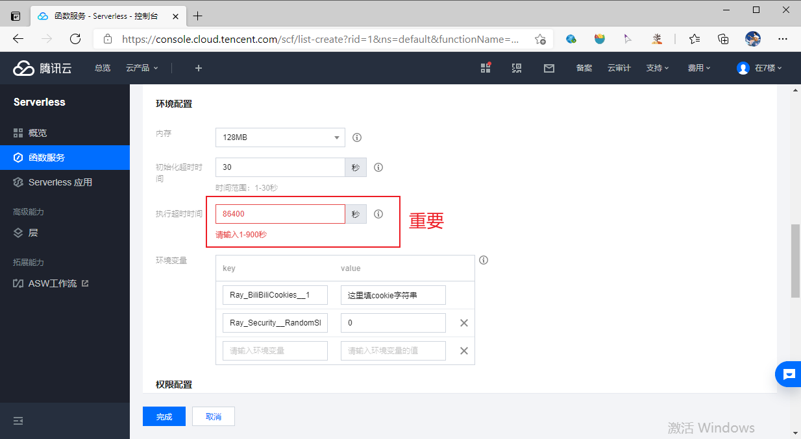
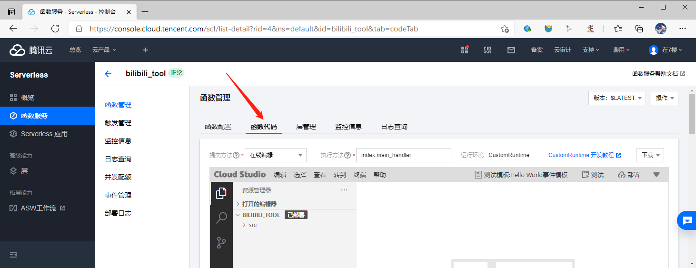
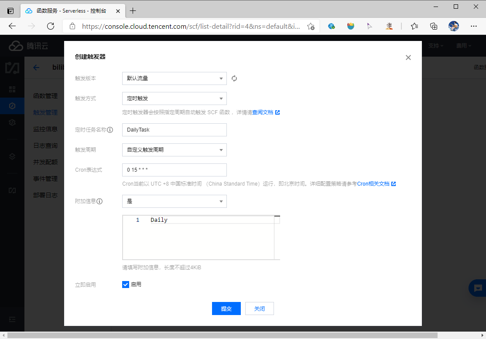

# 腾讯云云函数（SCF）部署说明
<!-- TOC depthFrom:2 -->

- [1. 介绍](#1-介绍)
- [2. 注册账号](#2-注册账号)
- [3. 部署](#3-部署)
    - [3.1. 方式一：上传zip包部署](#31-方式一上传zip包部署)
        - [3.1.1. 下载压缩包到本地](#311-下载压缩包到本地)
        - [3.1.2. 云函数控制台新增函数服务](#312-云函数控制台新增函数服务)
        - [3.1.3. 手动运行测试](#313-手动运行测试)
        - [3.1.4. 配置触发器，设定运行时间和频率](#314-配置触发器设定运行时间和频率)
    - [3.2. 方式二：Actions自动部署](#32-方式二actions自动部署)

<!-- /TOC -->

## 1. 介绍
见[腾讯云官网](https://cloud.tencent.com/document/product/583)

## 2. 注册账号
注册成功后，需要激活云函数SCF功能。因为会赠送免费额度，所以正常使用是免费的。

## 3. 部署
### 3.1. 方式一：上传zip包部署
#### 3.1.1. 下载压缩包到本地
点击[BiliBiliTool/release](https://github.com/RayWangQvQ/BiliBiliTool/releases)，选择最新版本的 `tencent-scf.zip` ，下载到本地
#### 3.1.2. 云函数控制台新增函数服务
Ⅰ.进入[云函数控制台](https://console.cloud.tencent.com/scf/)，单击左侧导航栏【函数服务】，进入“函数服务”页面。顶部地域选择一个靠近自己地址的，点击新建按钮。如下图：

Ⅱ.填写基本信息
* 创建方式：选择自定义创建
* 函数名称：bilibili_tool
* 地域：刚才已经选过了
* 运行环境：CustomRuntime
* 函数代码提交方式：本地上传zip包
* 执行方法：index.main_handler
* 函数代码：点击后选择之前本地下载好的zip包

如下图：

Ⅲ.点击展开高级配置，在环境变量中添加配置，这里先加 2 个配置就行了，后续可以再添加其他的。
* cookie 配置：key 为 `Ray_BiliBiliCookies__1` ， value 为之前浏览器抓取到的cookie字符串
* 随机睡眠配置：key 为 `Ray_Security__RandomSleepMaxMin` ，value 为 `0` （为了方便测试，所以先关掉，后面测好之后再删掉该配置，或者自己改一个value值）
如下图：

Ⅳ.继续下滚，找到执行配置模块，
* 异步执行：勾选启用
* 状态追踪：勾选启用

如下图：

Ⅴ.点击完成按钮，创建函数。（触发器配置先不用管，可以等测试完成后再添加）

#### 3.1.3. 手动运行测试
Ⅰ.成功创建函数后，会看到如下的函数管理页面，点击顶部函数代码 Tab 页，准备测试，如下图：

Ⅱ.下拉，找到测试按钮，点击运行测试，页面下方会同步显示日志。如果运行正常，则表示部署已成功。如下图:

#### 3.1.4. 配置触发器，设定运行时间和频率
Ⅰ.点击左侧【触发管理】导航，点击“创建触发器”按钮，如下图：

Ⅱ.填写触发器信息
* 触发方式：定时触发
* 定时任务名称：DailyTask
* 触发周期：自定义触发周期
* Cron表达式：自己根据需求指定，10 15 * * * 表示每天15点10分运行，不会的可以做下搜索工作，规则很简单
* 附加信息：是
* 信息内容：`Daily`
* 立即启用：勾选启用
填完后点击提交按钮提交，即可完成。如下图：

这里的附加信息将作为runTasks（欲运行的任务编码）配置，通过命令行传入程序。想多个任务共用一个触发器的话，可以使用&号拼接任务编码，填入附加信息，如 `Daily&LiveLottery`

等到触发器设定的时间，对应的触发器就会去运行应用，自动完成任务。

### 3.2. 方式二：Actions自动部署
待开发